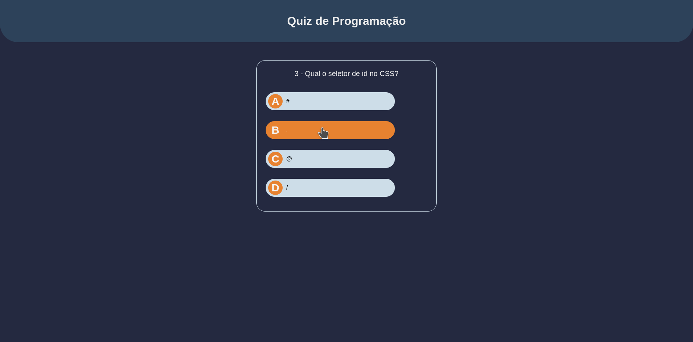
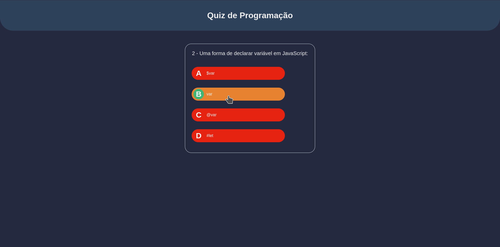

# JS Vanilla Quiz
Demo: TBD

### Tecnologias utilizadas

## Resumo do projeto
O JS Vanilla Quiz é um protótipo de jogo no estilo Quiz, uma pergunta é feita e 4 alternativas são oferecidas para o participante escolher dentre elas a resposta correta. :ballot_box_with_check:

Instruções de execução do projeto [aqui](./doc/exec_instructions.md)

## Screenshots
  - __Escolhendo uma alternativa__:
  
  
  - __Resposta correta__:
  

  - __Resposta errada__:
  

  - __Finalizando o quiz com 100% de acerto__:
  